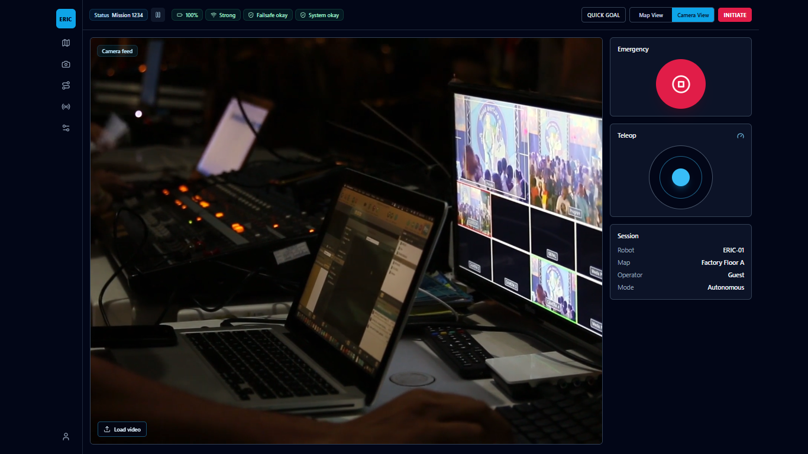
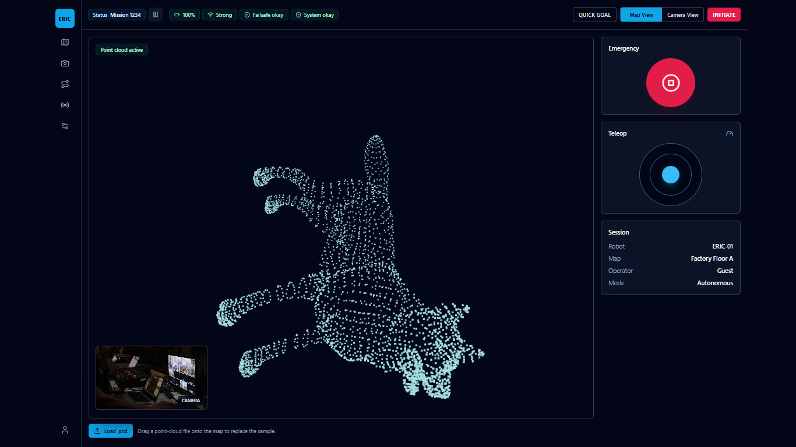

# Insight.IO Robotics Dashboard

Insight.IO is a React and Vite dashboard prototype for monitoring an autonomous robotics session. It combines a 3D point-cloud map viewer, camera feed simulation, mission status controls, and operator widgets in a focused operations interface.

## Screenshots




## Features

- Interactive 3D `.pcd` point-cloud viewer with orbit controls
- Drag-and-drop and file-picker support for custom point-cloud files
- Camera feed simulation with local video upload support
- Responsive operations layout for desktop, tablet, and mobile screens
- Mission status bar with battery, network, safety, and system indicators
- Emergency stop, teleoperation, and session summary panels
- Built with production-friendly React component structure and Tailwind CSS

## Tech Stack

- React 18
- Vite 5
- Tailwind CSS
- Three.js, `@react-three/fiber`, and `three-stdlib`
- Framer Motion
- Lucide React

## Getting Started

### Prerequisites

- Node.js 18 or newer
- npm 9 or newer

### Installation

```bash
npm install
```

### Development

```bash
npm run dev
```

Open the local URL shown in the terminal, usually `http://localhost:5173`.

### Production Build

```bash
npm run build
```

### Preview Production Build

```bash
npm run preview
```

## Project Structure

```text
.
├── public/
│   ├── sample.mp4
│   └── sample.pcd
├── src/
│   ├── assets/
│   ├── App.jsx
│   ├── index.css
│   └── main.jsx
├── index.html
├── package.json
├── tailwind.config.js
└── vite.config.js
```

## Using Sample Assets

- The dashboard loads `public/sample.pcd` as the default map.
- The camera panel uses `public/sample.mp4` until a custom video is selected.
- Custom `.pcd` files can be dropped directly on the map viewer or selected with the map file picker.

## Quality Checks

```bash
npm run build
```

The current package configuration does not include a lint script. Add one before enforcing linting in CI.

## Author

Samriddhi Chandra
